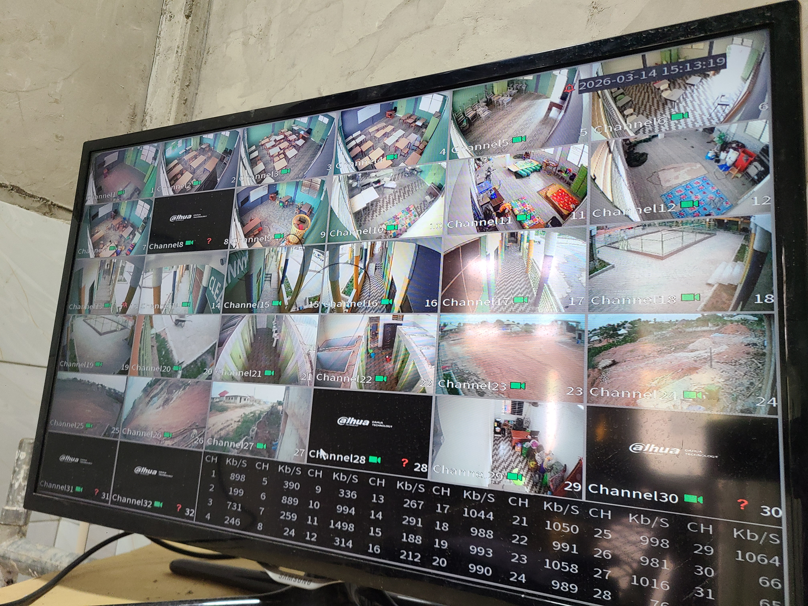
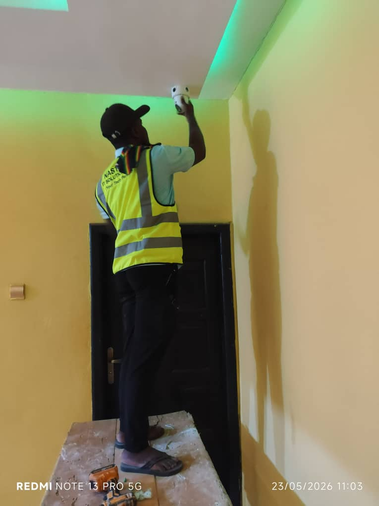
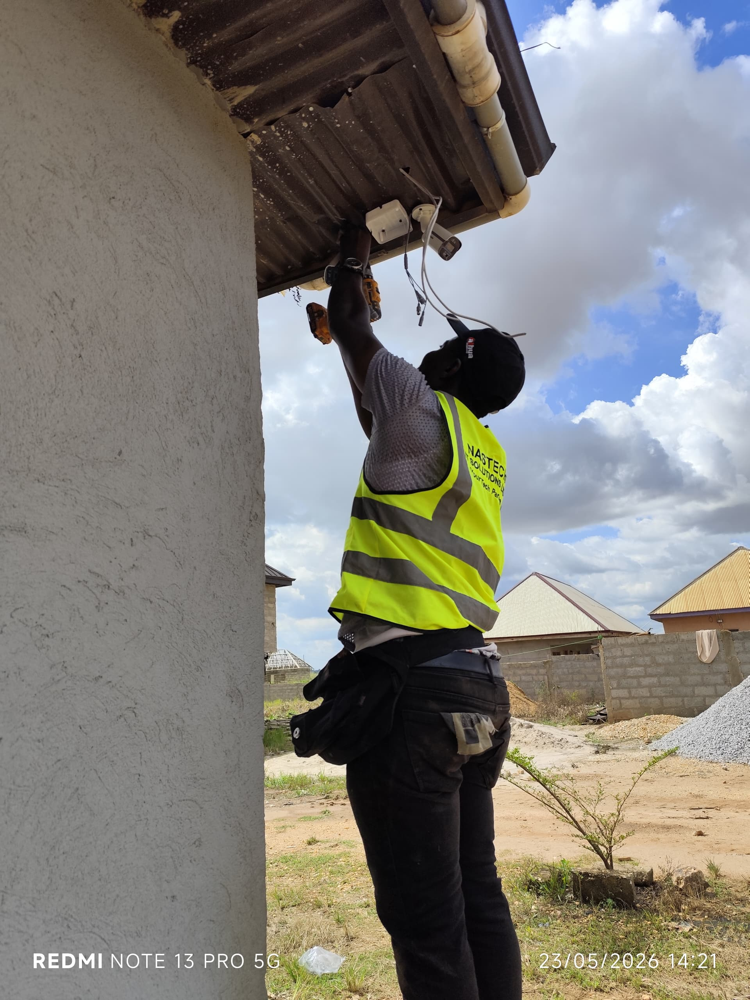
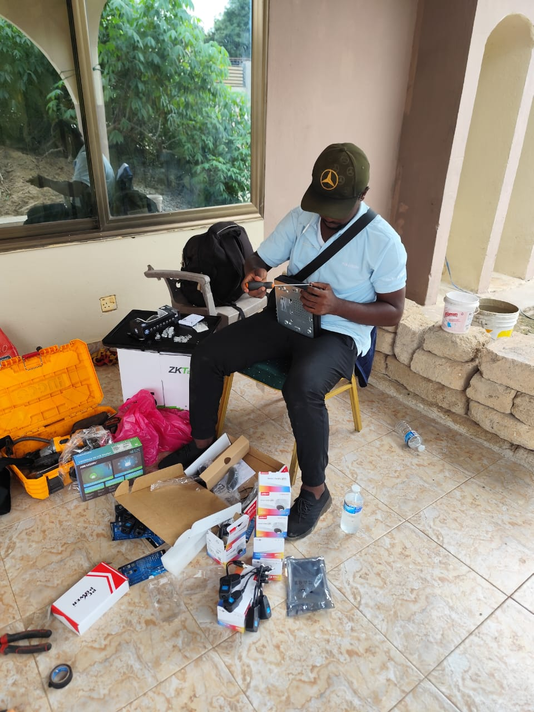

# CCTV Installation & Security Projects

Welcome to my CCTV portfolio.

This section showcases selected CCTV installation and security surveillance work completed as part of my technical engineering projects.

## What I Do

- CCTV camera installation
- DVR/NVR setup and configuration
- Camera positioning and coverage planning
- CCTV cabling and termination
- System testing and commissioning
- Remote viewing setup
- CCTV maintenance and troubleshooting
- Security surveillance solutions

## Work Gallery

### CCTV Installation

## CCTV Showcase Videos

The following videos demonstrate CCTV installation work and completed security systems.

- [Watch CCTV Showcase Video 1](VID-20260528-WA0087.mp4)
- [Watch CCTV Showcase Video 2](VID-20260529-WA0067.mp4)
- [Watch CCTV Showcase Video 3](VID-20260806-WA0023.mp4)

## Technical Approach

Every CCTV project begins with understanding the client's security requirements and assessing the environment.

I focus on:

- Appropriate camera positioning
- Reliable cabling and connections
- Suitable surveillance coverage
- Proper DVR/NVR configuration
- System testing
- Recording verification
- Remote monitoring where required
- Professional handover to the client

## Project Objective

The objective of each installation is to provide a reliable surveillance system that helps clients monitor their properties, improve security awareness and review recorded events when necessary.

## Technical Engineering

My work combines practical installation, system configuration, troubleshooting and client-focused technical support to deliver functional security solutions.

---

**ManeTech Inc.**

**Design. Connect. Secure.**
